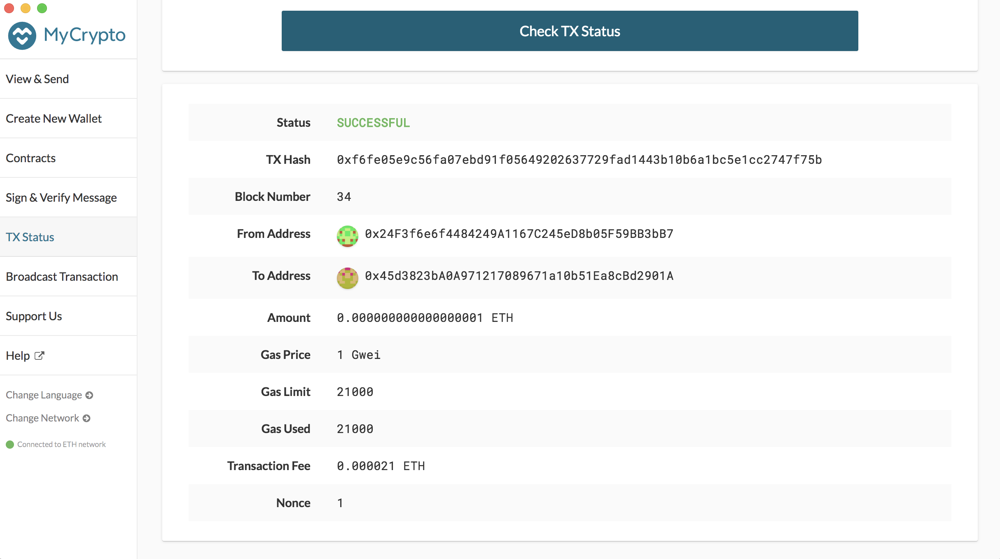

# **Multi-Blockchain-Wallet-in-Python**
---

---

## **Background**
Your new startup is focusing on building a portfolio management system that supports not only traditional assets like gold, silver, stocks, etc, but crypto-assets as well! The problem is, there are so many coins out there! It's
a good thing you understand how HD wallets work, since you'll need to build out a system that can create them.

## **Objective**

You're in a race to get to the market. There aren't as many tools available in Python for this sort of thing, yet.
Thankfully, you've found a command line tool, `hd-wallet-derive` that supports not only BIP32, BIP39, and BIP44, but
also supports non-standard derivation paths for the most popular wallets out there today! However, you need to integrate
the script into your backend with your dear old friend, Python.

Once you've integrated this "universal" wallet, you can begin to manage billions of addresses across 300+ coins, giving
you a serious edge against the competition.

In this assignment, however, you will only need to get 2 coins working: Ethereum and Bitcoin Testnet.
Ethereum keys are the same format on any network, so the Ethereum keys should work with your custom networks or testnets.

## **Dependencies**

Installation guides are available in Guides folder

[HD Wallet Derive Installation Guide](Guides/HD_Wallet_Derive_Install_Guide.md)  
[Blockchain TX Installation Guide](Guides/Blockchain_TX_Install_Guide.md)  
Mnemonic for path and address derivation needs to be stored in .env file

## **Tools/Libraries**
* Python
* Web3
* bit
* eth_account
* subprocess
* dotenv
* os

## **Code**

Codes files are to be in the hd-wallet-derive folder to be run.

* [wallet](wallet.py)
* [constants](constants.py)

## **Outputs**

Output screenshot are in Outputs folder.

1. **HD Derive Wallet** 
   
   

   

2. **Mnemonic Generation**
   
   

3. **Generation of addresses and Bitcoin Testnet Transactions**

   

    Transaction id :`d67de9a78dd24d5697da550d3762138dce72c7c934de484ddae2fac009890764`

    

 4. **Ethereum POA Transaction Outputs**
    
    

    

---